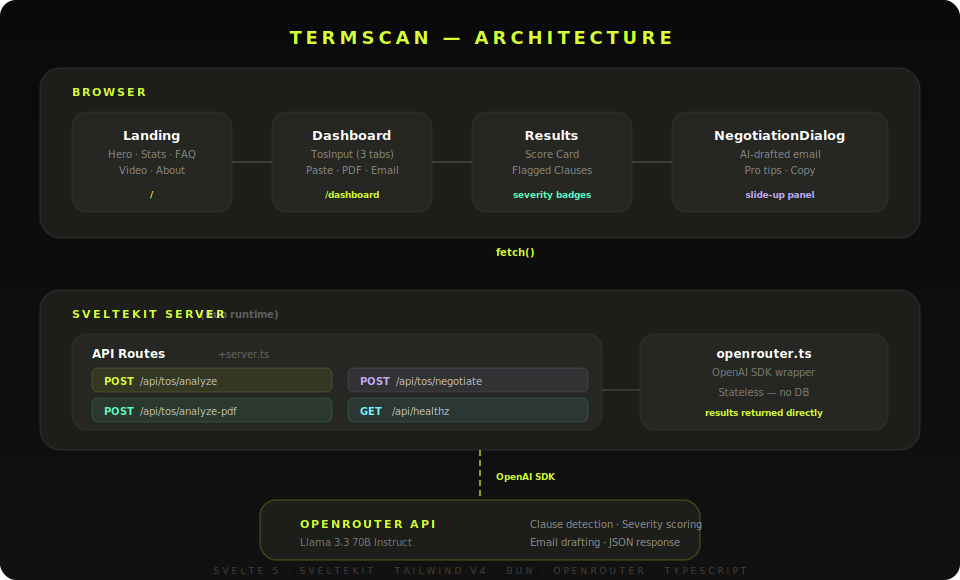

<p align="center">
  
</p>

<h1 align="center">TermScan</h1>

<p align="center">
  <strong>AI-powered Terms of Service analyzer — know what you're agreeing to before you click accept.</strong>
</p>

<p align="center">
  
  
  
  
</p>

---

> Paste a Terms of Service, upload a PDF, or drop in an email — TermScan flags every risky clause, scores its severity, and drafts a professional pushback email in seconds.

---

## Features

- **3 Input Modes** — Paste text, upload a PDF (up to 10 MB), or paste email content
- **12 Risk Categories** — Data Selling, Auto-Renewal, Arbitration, Liability Waiver, Privacy, Behavioral Tracking, and more
- **Severity Scoring** — Each clause scored 1–10 with Mild / Concerning / Dangerous classification
- **Negotiation Emails** — One-click AI-generated professional emails to challenge specific clauses
- **Dark-Theme UI** — Custom design system with Space Grotesk, yo-yellow accents, animated transitions

---

## Architecture

<p align="center">
  
</p>

<details>
<summary>Text version</summary>

```
┌─────────────────────────────────────────────────────────────────┐
│                          BROWSER                                │
│                                                                 │
│   ┌─────────┐    ┌───────────┐    ┌──────────┐    ┌─────────┐  │
│   │ Landing  │───▶│ Dashboard │───▶│ Results  │───▶│Negotiate│  │
│   │  Page    │    │ + TosInput│    │  View    │    │ Dialog  │  │
│   └─────────┘    └─────┬─────┘    └──────────┘    └─────────┘  │
│                        │ fetch()                                │
└────────────────────────┼────────────────────────────────────────┘
                         │
┌────────────────────────┼────────────────────────────────────────┐
│                  SVELTEKIT SERVER (Bun)                          │
│                        │                                        │
│   ┌────────────────────▼─────────────────────┐                  │
│   │           API Routes (+server.ts)        │                  │
│   │                                          │                  │
│   │  POST /api/tos/analyze      ─── text     │                  │
│   │  POST /api/tos/analyze-pdf  ─── pdf      │                  │
│   │  POST /api/tos/negotiate    ─── email    │                  │
│   │  GET  /api/healthz          ─── status   │                  │
│   └──────────────────────┬───────────────────┘                  │
│                          │                                      │
│                          ▼                                      │
│              ┌─────────────────────┐                            │
│              │   OpenRouter API    │                            │
│              │   (Llama 3.3 70B)   │                            │
│              │                     │                            │
│              │  • Clause detection │                            │
│              │  • Severity scoring │                            │
│              │  • Email drafting   │                            │
│              └─────────────────────┘                            │
└─────────────────────────────────────────────────────────────────┘
```
</details>

### Tech Stack

| Layer | Technology |
|-------|-----------|
| Runtime | [Bun](https://bun.sh) |
| Framework | [SvelteKit](https://svelte.dev/docs/kit) (Svelte 5 with runes) |
| Styling | [Tailwind CSS v4](https://tailwindcss.com) + custom design tokens |
| AI | [Llama 3.3 70B Instruct](https://openrouter.ai) via OpenRouter (OpenAI-compatible SDK) |
| PDF Parsing | pdf-parse |
| Icons | lucide-svelte |
| Toasts | svelte-sonner |

---

## Project Structure

```
src/
├── routes/
│   ├── +layout.svelte                 # Global layout + toast provider
│   ├── +page.svelte                   # Landing page (/)
│   ├── dashboard/+page.svelte         # Scanner + results (/dashboard)
│   └── api/
│       ├── healthz/+server.ts         # Health check
│       └── tos/
│           ├── analyze/+server.ts     # Text analysis endpoint
│           ├── analyze-pdf/+server.ts # PDF analysis endpoint
│           └── negotiate/+server.ts   # Negotiation email endpoint
├── lib/
│   ├── components/
│   │   ├── Landing.svelte             # Full landing page (hero → FAQ)
│   │   ├── Results.svelte             # Analysis results display
│   │   ├── forms/TosInput.svelte      # 3-tab input form
│   │   ├── dialogs/NegotiationDialog.svelte
│   │   └── layout/
│   │       ├── Navbar.svelte
│   │       └── Footer.svelte
│   ├── server/
│   │   └── openrouter.ts              # OpenRouter AI client
│   └── utils.ts                       # cn() class merge helper
├── app.css                            # Tailwind theme + custom utilities
└── app.html                           # HTML shell + meta tags
```

---

## Getting Started

### Prerequisites

- [Bun](https://bun.sh) >= 1.0
- [OpenRouter](https://openrouter.ai) API key

### Setup

```bash
# Clone and install
git clone <repo-url> termscan
cd termscan
bun install

# Configure environment
cp .env.example .env
# Edit .env with your OPENROUTER_API_KEY

# Start development server
bun run dev
```

Open [http://localhost:5173](http://localhost:5173).

### Build for Production

```bash
bun run build
bun run preview
```

SvelteKit's `adapter-auto` detects your deployment platform (Vercel, Netlify, Cloudflare, Node, etc.) and configures itself accordingly.

---

## Environment Variables

| Variable | Description |
|----------|-------------|
| `OPENROUTER_API_KEY` | OpenRouter API key for Llama 3.3 70B |

---

## API Reference

### `POST /api/tos/analyze`
Analyze plain text Terms of Service.

```json
{ "text": "Terms of Service content...", "companyName": "Acme Corp" }
```

### `POST /api/tos/analyze-pdf`
Analyze a PDF document. Send as `multipart/form-data` with `file` (PDF) and optional `companyName`.

### `POST /api/tos/negotiate`
Generate a negotiation email for a specific clause.

```json
{
  "clauseExcerpt": "...",
  "clauseCategory": "Data Selling",
  "clauseExplanation": "...",
  "companyName": "Acme Corp"
}
```

### `GET /api/healthz`
Returns `{ "status": "ok" }`.

---

## License

MIT
